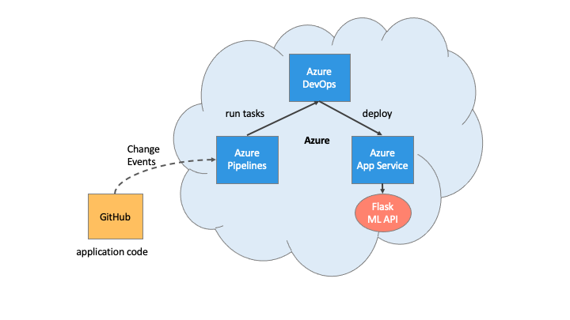

# Azure Infrastructure Operations Project: Building a CI/CD Pipeline

> This project demonstrates how to build a Github repository from scratch and create a scaffolding to assist in performing both Continuous Integration and Continuous Delivery. The project uses Github Actions along with a Makefile, requirements.txt and application code to perform an initial lint, test, and install cycle. Lastly the project will integrate Azure Pipelines to enable Continuous Delivery to Azure App Service.


# Overview

This project demonstrates how to build a Github repository from scratch and create a scaffolding to assist in performing both Continuous Integration and Continuous Delivery. The project uses Github Actions along with a Makefile, requirements.txt and application code to perform an initial lint, test, and install cycle. Lastly the project will integrate Azure Pipelines to enable Continuous Delivery to Azure App Service.

## Project Plan

* [Trello board](https://trello.com/b/LirRms2w) 
* [Project plan](https://docs.google.com/spreadsheets/d/1nh8Js1f2Pm17IbPwdjDykV-pCO2gOOzg_EjWI1cFxTU/edit?usp=sharing)

## Architectural Diagram



## Getting Setup

### Dependencies
1. Create an [Azure Account](https://portal.azure.com)
2. Create an [Azure Pipelines Account](https://dev.azure.com/)
3. Install the [Azure command line interface](https://docs.microsoft.com/en-us/cli/azure/install-azure-cli?view=azure-cli-latest)
4. Install in your GitHub account [Azure Pipelines](https://github.com/marketplace/azure-pipelines)

### Instructions

#### Step 1: Get necessary azure credentials needed for your deployment
* Log onto to Azure Portal
* Open Azure Cloud Shell
* Create ssh-keys in Azure Cloud Shell
* Upload ssh-keys to Github
* Create a GitHub Repo
* When the GitHub Repo has been created select the option 'Clone with SSH'
* In Azure Cloud Shell Clone the source locally:
  ```sh
  $ git clone git@github.com:thepembeweb/building-a-ci-cd-pipeline.git
  ```    
  
    
#### Step 2: Local Test
* Setup a Virtual Environment
  ```sh
  $ cd building-a-ci-cd-pipeline
  $ python3 -m venv ~/.building-a-ci-cd-pipeline
  $ source ~/.building-a-ci-cd-pipeline/bin/activate
  ```    
* Run make all to install dependencies in the virtual environment and run tests
  ```sh
  $ make all
  ```
  

* Start the application in the local environment:
  ```
  python app.py
  ```
* Open a separate Cloud Shell and test that the app is working:
  ```
  ./make_prediction.sh
  ```
  

#### Step 3: Deploy the app to an Azure App Service
* Create an App Service in Azure with the following command where you specify your app and resource group names
    ```
    az webapp up -n <your-appservice> -g <your-resource-group>
    ```
  
* App Service running in Azure
  

#### Step 4: Configure GitHub Actions
* Enable GitHub Actions in the GitHub UI as shown [here](https://docs.github.com/en/free-pro-team@latest/actions/managing-workflow-runs/disabling-and-enabling-a-workflow)
* Replace yml code with scaffolding
  ```bash
  name: Python application test with Github Actions

  on: [push]

  jobs:
    build:

      runs-on: ubuntu-latest

      steps:
      - uses: actions/checkout@v2
      - name: Set up Python 3.5
        uses: actions/setup-python@v1
        with:
          python-version: 3.5
      - name: Install dependencies
        run: |
          make install
      - name: Lint with pylint
        run: |
          make lint
      - name: Test with pytest
        run: |
          make test
  ```
* Verify remote tests pass in GitHub Actions UI
  

    
#### Step 5: Enable Continuous Deployment with Azure Pipelines
* Create a Azure DevOps Project and then establish a service connection for Azure Pipelines and Azure App Service as shown [here](https://docs.microsoft.com/en-us/azure/devops/pipelines/ecosystems/python-webapp?view=azure-devops&WT.mc_id=udacity_learn-wwl)
  
* Running Azure App Service from Azure Pipelines automatic deployment
  
* Verify the prediction  
  
* View output of streamed log files from deployed application
  ```
    az webapp log tail
  ```
  
    
#### Step 6: Load testing with Locust
* Install locust:
  ```
  pip install locust
  ```
* Ensure the app is running:
  ```
  python app.py
  ```
* Start locust:
  ```
  locust
  ```
* Open a browser and go to [http://localhost:8089](http://localhost:8089). Enter the total number of users to simulate, spawn rate, set the host to localhost:5000, and click Start Swarming: 
  


## Enhancements

* Add and deploy a frontend service
* Run the apps on Kubernetes cluster
* Build multiple environments for the apps - development, staging, production environments

## Demo 

<TODO: Add link Screencast on YouTube>

## Built With

* [Azure](https://portal.azure.com/) - Cloud service provider used
* [Python](https://www.python.org/) - The programming language used
* [Boston Housing](https://www.kaggle.com/c/boston-housing) - Kaggle Data source

## Authors

* **[Pemberai Sweto](https://github.com/thepembeweb)** - *Initial work* - [Building a CI/CD Pipeline](https://github.com/thepembeweb/building-a-ci-cd-pipeline)

## License

[](http://badges.mit-license.org)

- This project is licensed under the MIT License - see the [LICENSE](LICENSE.md) file for details
- Copyright 2020 © [Pemberai Sweto](https://github.com/thepembeweb).


